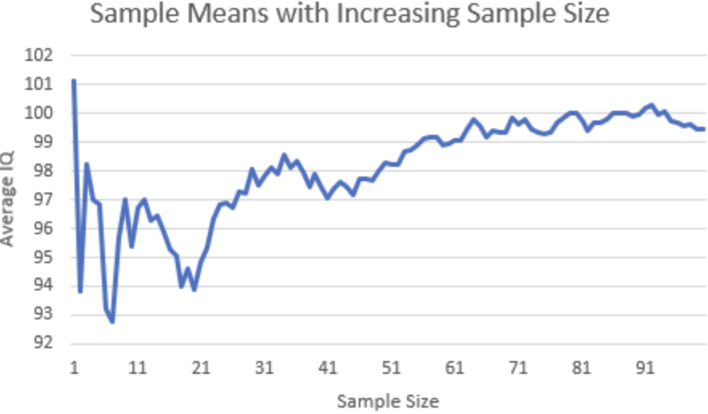

Let’s imagine a scenario in which a person flips a fair coin ten times, and, by chance, it lands heads eight times. Since the probability of a fair coin landing heads is 50%, an 80% heads rate seems somewhat illogical. This raises a classic question: If we continue flipping the coin, should we expect a string of tails to “make up” for these extra heads?

This question both illustrates the intuition behind the **Law of Large Numbers** and reveals one of the most common misunderstandings about it.

The law of large numbers states that, under appropriate conditions, as the number of observations increases, the average of the results from multiple observations will approach the expected value. For a fair coin, the expected proportion of heads is 0.5. However, if the coin is flipped only a few times, the observed proportion may deviate significantly from 0.5. As the number of flips increases, this proportion typically becomes more stable.

Mathematically, if we observe values \(X_1, X_2...X_n\), their sample average is

$$
\bar{X}_n = \frac{1}{n}\sum_{i=1}^{n}X_i.
$$

The Law of Large Numbers tells that, as \(n\) becomes larger and larger,

$$
\bar{X}_n \rightarrow E[X],
$$

where \(E[X]\) is the expected value of the underlying random variable.

For a coin flip, we can define heads as 1 and tails as 0. For a fair coin,

$$
E[X] = 0.5.
$$

So if we flip the coin again and again, the average of these zeros and ones tends to move toward 0.5.

## Why Is This Unintuitive?

Surprisingly, the law of large numbers **does not** imply that random outcomes will actively correct themselves.

Suppose that eight out of the first ten coin flips result in heads. Most people’s common reaction might be to think that the probability of getting tails must now be higher so that the overall ratio can return to 50%. This is actually a classic example of a fallacy.

If the coin tosses are independent of one another, then the probability of getting heads on the eleventh toss is still exactly 50%. The coin does not “remember” what happened before.

So, how does the average eventually converge toward 50%?

The answer is not “correction,” but **dilution**.

After ten tosses, the first ten observations make up the entire sample. After 1,000 tosses, these first ten observations account for only 1% of the sample; after 10,000 tosses, they account for only 0.1%. The initial anomaly hasn’t disappeared, but its impact on the overall average becomes increasingly small.

In other words, the law of large numbers holds true because, as the number of observations increases, the influence of early random fluctuations becomes increasingly negligible.

## More Data Does Not Mean Perfect Data

Another common misconception is that a large sample size will always yield results that perfectly match the expected value. However, the law does not guarantee this.

Even if you flip a coin thousands of times, the proportion of heads might be 49.7% or 50.4%, rather than exactly 50%. Random fluctuations still occur. The key point is that as the sample size increases, the frequency of large deviations decreases.

The importance of this concept extends far beyond coin flipping. Economists use sample means to estimate wages, unemployment rates, consumer spending, and many other indicators. A survey of 20 people may be strongly influenced by a few outliers. Larger, representative samples are typically more stable because individual random variations have less impact on the population mean.

This is also why collecting more data improves statistical estimates. More observations do not eliminate randomness, but they reduce the impact of random fluctuations in any small portion of the sample.

## Key Points Summary

The Law of Large Numbers does not mean that luck “balances itself out” by compensating for past results with future ones. Rather, it states that as more independent observations accumulate, the proportion of early outliers in the overall mean becomes increasingly small.

A practical way to remember this concept is:

**Large numbers do not correct for randomness—they merely dilute it.**

It is precisely this distinction that makes the Law of Large Numbers both powerful and prone to misunderstanding.

---
